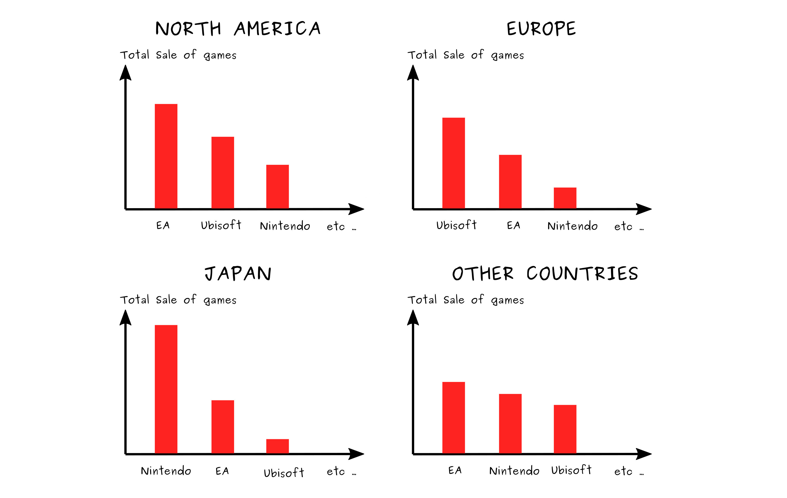

# Data Visualization Project : Process Book

# Table of contents
- [About the workflow](#about-the-workflow)
  - [About the tools](#about-the-tools)
  - [About the code](#about-the-code)
- [About the style](#about-the-style)
- [Initial Layout Mockup](#initial-layout-mockup)
- [About the data](#about-the-data)
- [Exploring the data](#exploring-the-data)
  - [Consoles war](#consoles-war)
  - [Publishers war](#publishers-war)
  - [Games analysis](#games-analysis)
- [Some extra notes on our decisions](#some-extra-notes-on-our-decisions)
- [Conclusion](#conclusion)

# About the workflow

## About the tools

Before looking at the data, we'd like to explain our decisions in terms of workflow. In the correction of the lab we were given a boilerplate using ES6 + D3 + Babel + SCSS + NPM + Webpack + React + ... but we choose not to use it in our project because we wanted to understand all of our code and only have the necessary code :

- We were not interested in using SCSS because CSS is sufficient for our use case (and we can always use [CSS Variables](https://developer.mozilla.org/en-US/docs/Web/CSS/Using_CSS_variables) if we needed)

- Because we are not using SCSS or any other types of assets or languages, we didn't need Webpack

- React is very interesting but doesn't really fit with what we saw in class with `d3`. Indeed React automatically updates the DOM tree by diffing the new virtual DOM tree with the current one and commits only the changes between the two. But in class we saw how to manage the those changes manually with `d3` methods like `.enter()` and `.exit()`.

- We are only targeting modern browser thus we can use ES6 class (https://caniuse.com/#feat=es6-class) so we don't need to transpile them with Babel.

In conclusion, for our use case, we have everything we need with with vanilla JS, CSS and HTML. The only problem is that Module Loading is not yet standardized thus with needed `Rollup` to bundle all our classes in one JS file.

Hopefully this make our project structure simpler by not stacking dozens of framework and tools : https://hackernoon.com/how-it-feels-to-learn-javascript-in-2016-d3a717dd577f

## About the code

Concerning the code we went with a clean and modulable code. Unfortunately we couldn't use the WebComponents standard because some of the spec is not yet standardized (disagreement concerning HTML imports while [Custom Elements not yet implemented everywhere](https://caniuse.com/#feat=custom-elementsv1))

But still our code is very well "componentized", *every view has its own ES6 class and it's own css file.*

# About the style

We took inspiration from the "Swiss Style" also known as the [International Typographic Style](http://www.designishistory.com/home/swiss/). Here are some examples :

We've used fonts that convey this style but that are free (unlike the proprietary fonts such as [Helvetica](https://en.wikipedia.org/wiki/Helvetica) or  Brown Pro)

In terms of color, we've picked some from [this site](http://swisscolors.net/) and we exposed them in [CSS Variables](https://developer.mozilla.org/en-US/docs/Web/CSS/Using_CSS_variables) to remain coherent through the whole visualization.

Overall we want to convey a "magazine" feeling, we even added some effect like very subtle paper grain to try even more emphasis this aspect.

# Initial Layout Mockup

We decided that the general layout for our visualization would be the following :

This allow the user to follow our story by just scrolling a single page, yet still having the left menu for quick access to any particular section. Furthermore this kind of navigation is adapted to all form factors (phone, tablets,desktops)

# About the data

Our data set is about **Video Games Sales and Ratings**, it comes from the Kaggle Platform : https://www.kaggle.com/rush4ratio/video-game-sales-with-ratings

This data set contains the following features :

- Name of the game
- Platform (Wii, X360, PS3, PS2, etc...)
- Year of Release
- Genre (Shooter, Sports, Action, ...)
- Publisher
- Sales in North America
- Sales in Europe
- Sales in Japan
- Sales in other countries
- Global sales (= sum of NA + EU + JP + Other sales)
- Critic Score (out of 100)
- Critic Count
- User Score (out of 10)
- User Count
- Developer
- Rating ( E, E10+, M, ... )

The original data set comes from [here](https://www.kaggle.com/gregorut/videogamesales) and contains more than 16,000 games. But the data set we have is extended with critic and user scores. About 6,900 games could be extend with those scores (i.e games whose scores could be found on [Metacritic](http://www.metacritic.com/browse/games/release-date/available).

# Exploring the data

Looking at the features, three main topic came to our mind :
- Consoles War
- Publisher War
- General games analysis

For each topic we considered all pairs of features and kept only those which seemed to answer relevant questions :

Now we will explore some ideas of visualization for each topic and see which questions they might answer.

## Consoles war

### Sales evolution per Console (Platform + Sales + Years)

Question this answers : **What is the popularity of consoles over the years ?**

### Sales repartition per Console and per Genre (Platform + Sales + Genre)

We considered different representations, among them we had :

But we found the array chart to be less intuitive than the second one. Moreover the second one allows to see and to order by total sale (height of the bar).

Question this answers : **Which genres are more popular per console ?**

## Publishers war

### Critics over the Years per Publisher (Publisher + Critics + Years)

Question this answers : **What is the evolution of the quality of publishers' games ?**

### Sales over the Years per Publisher (Publisher + Sales + Years)

Same as above but with sales on the y-axis.

Question this answers : **What is the evolution of publishers popularity ?**

### Repartition of Publishers sales per Platform (Publisher + Platform + Sales)

Here again we could have used the array representation like mentioned before but as we said before we didn't find it intuitive. We also considered pie chart and also bar chart as before :

Question this answers : **What is the dominance of publishers on each platform ?**

### Repartition of Publishers sales per Genre (Publisher + Platform + Genre)

Same as above but with genre instead of consoles.

Question this answers : **What kind of game publishers are the most famous for?**

### Top 5 Publisher per region (Publisher + Genre + Sales per Region)

Unfortunately, our features only separate sales in JP, EU, NA and other thus we don't have detail for every country and so it doesn't make a lot of sense to visualize them on a map. Instead we propose four charts :

Question this answers : **Where publishers are the most popular ?**

### Console portage quality (consistency) (Publisher + Platform + Sales)

## Games analysis

### From unknown masterpieces to popular flops (Critics + Sales + Year)

### Evolution of Genre popularity (Sales + Genre + Year)

### Top 5 Genre per region

# Some extra notes on our decisions

As you may have notice, we chose to ignore some data. It's not because it would not be interesting to visualize them, but because we thought they were less relevant to the topics we wanted to explore :
  - we didn't use Ratings (E, E10+, M, ...)
  - we didn't use Developer but only Publisher. It would have been interesting to confront the two (Developers might get bought or work for other publishers) but wanted to remain general and only analyse publishers.
  - we didn't confront Critic Score vs. Critic Count or User Score vs. User Count. This would be more of a social study of the density of review in function of the review score ("For eg : Are people hating a game more likely to go on Metacritic and write a review than those loving the game ?")

Another question we encountered was : should we consider the sales or the number of game released ?
For example to reflect the popularity of a console over the years, should we represent the number of sales of games on that console or the number game released for that console ?

We ended up choosing sales over the number of release, but both options were a possible representation for the trends.

# Conclusion

  TODO : Complete when we finish the viz. What did we end up implementing and not implementing ? Problem encountered ? Are we satisfied ? Did we answer well questions we ask ourselves about the data ? etc...
