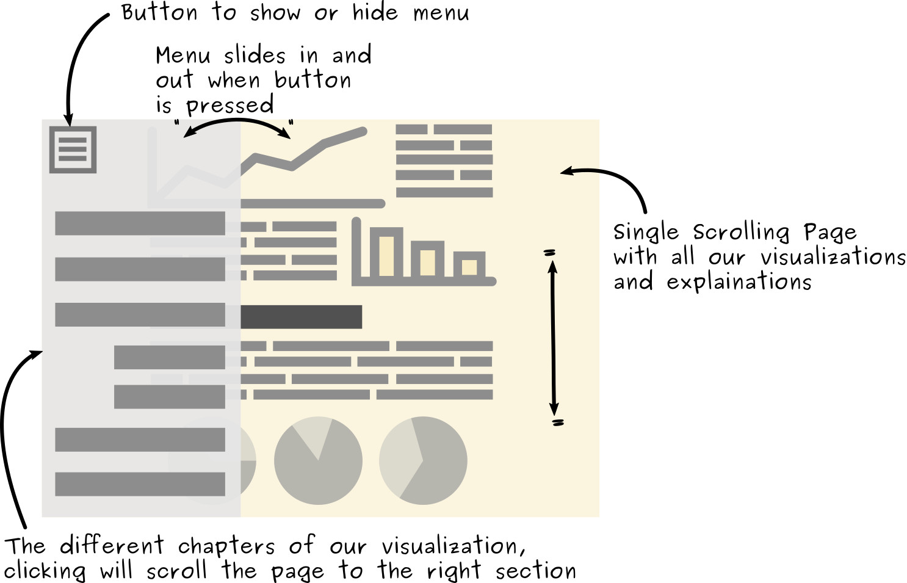
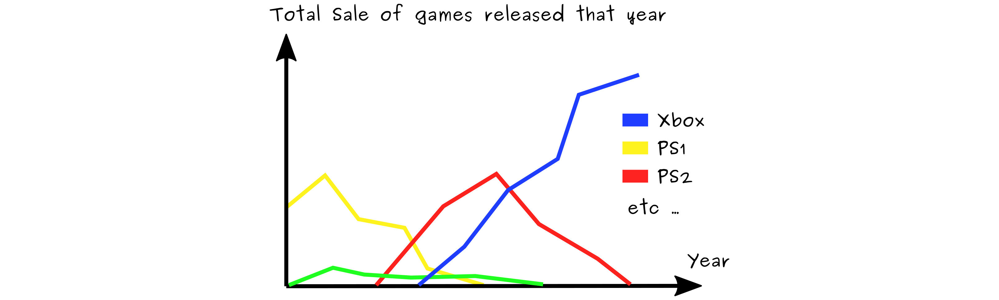
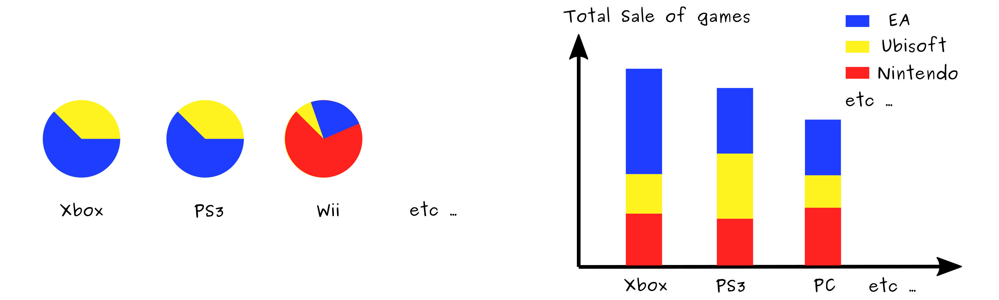
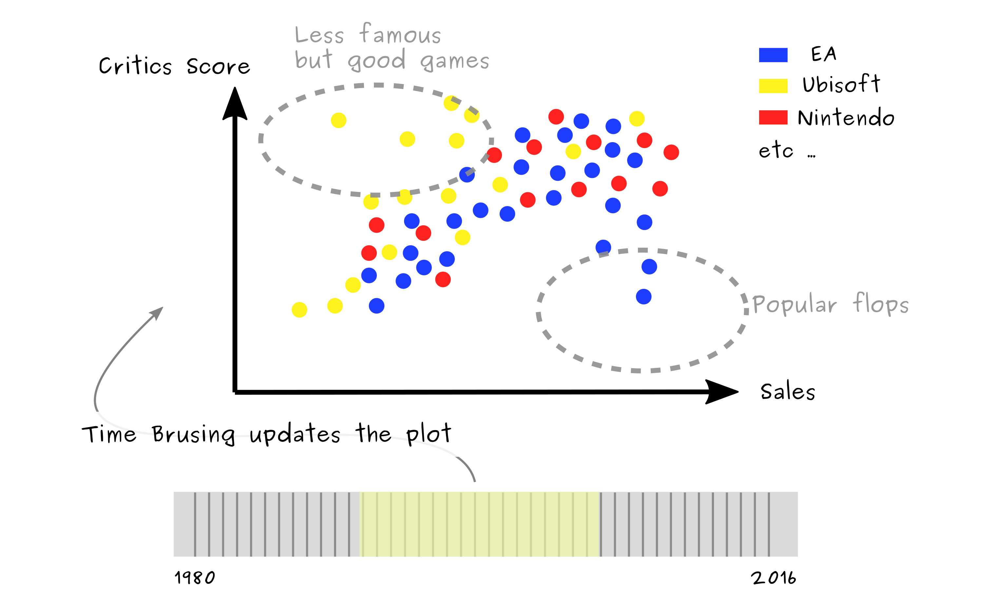

# Data Visualization Project : Process Book

# Table of contents
- [About the workflow](#about-the-workflow)
  - [About the tools](#about-the-tools)
  - [About the code](#about-the-code)
- [About the style](#about-the-style)
- [Initial Layout Mockup](#initial-layout-mockup)
- [About the data](#about-the-data)
- [Exploring the data](#exploring-the-data)
  - [Consoles war](#consoles-war)
  - [Publishers war](#publishers-war)
  - [Games analysis](#games-analysis)
- [Some extra notes on our decisions](#some-extra-notes-on-our-decisions)
- [Progress report](#progress-report)
  - [Consoles war report](#consoles-war-report)
  - [Publishers war report](#publishers-war-report)
  - [Games analysis report](#games-analysis-report)
- [Conclusion](#conclusion)

# About the workflow

## About the tools

Before looking at the data, we'd like to explain our decisions in terms of workflow. In the correction of the lab we were given a boilerplate using ES6 + D3 + Babel + SCSS + NPM + Webpack + React + ... but we choose not to use it in our project because we wanted to understand all of our code and only have the necessary code :

- We were not interested in using SCSS because CSS is sufficient for our use case (and we can always use [CSS Variables](https://developer.mozilla.org/en-US/docs/Web/CSS/Using_CSS_variables) if we needed)

- Because we are not using SCSS or any other types of assets or languages, we didn't need Webpack

- React is very interesting but doesn't really fit with what we saw in class with `d3`. Indeed React automatically updates the DOM tree by diffing the new virtual DOM tree with the current one and commits only the changes between the two. But in class we saw how to manage the those changes manually with `d3` methods like `.enter()` and `.exit()`.

- We are only targeting modern browser thus we can use ES6 class (https://caniuse.com/#feat=es6-class) so we don't need to transpile them with Babel.

In conclusion, for our use case, we have everything we need with with vanilla JS, CSS and HTML. The only problem is that Module Loading is not yet standardized thus with needed `Rollup` to bundle all our classes in one JS file.

## About the code

Concerning the code tried to keep a very modulable code. Unfortunately we couldn't use the WebComponents standard because some of the spec is not yet standardized (disagreement concerning HTML imports while [Custom Elements not yet implemented everywhere](https://caniuse.com/#feat=custom-elementsv1))

But still our code is well "componentized", every view has its own ES6 class and it's own css file.

# About the style

We took inspiration from the "Swiss Style" also known as the [International Typographic Style](http://www.designishistory.com/home/swiss/). Here are some examples :

We've used fonts that convey this style but that are free (unlike the proprietary fonts such as [Helvetica](https://en.wikipedia.org/wiki/Helvetica) or Brown Pro)

In terms of color, we've picked some from [this site](http://swisscolors.net/) and we exposed them in [CSS Variables](https://developer.mozilla.org/en-US/docs/Web/CSS/Using_CSS_variables) to remain coherent through the whole visualization.

Overall we wanted to convey a "magazine" feeling, we even added some effect like very subtle paper grain to try even more emphasis this aspect.

# Initial Layout Mockup

We decided that the general layout for our visualization would be the following :

This allow the user to follow our story by just scrolling a single page, yet still having the left menu for quick access to any particular section.

Also we will use [FlexBox](https://developer.mozilla.org/en-US/docs/Web/CSS/CSS_Flexible_Box_Layout/Using_CSS_flexible_boxes) to structure our page in a responsive way.

# About the data

Our data set is about **Video Games Sales and Ratings**, it comes from the Kaggle Platform : https://www.kaggle.com/rush4ratio/video-game-sales-with-ratings

This data set contains the following features :

- Name of the game
- Platform (Wii, X360, PS3, PS2, etc...)
- Year of Release
- Genre (Shooter, Sports, Action, ...)
- Publisher
- Sales in North America
- Sales in Europe
- Sales in Japan
- Sales in other countries
- Global sales (= sum of NA + EU + JP + Other sales)
- Critic Score (out of 100)
- Critic Count
- User Score (out of 10)
- User Count
- Developer
- Rating ( E, E10+, M, ... )

The original data set comes from [here](https://www.kaggle.com/gregorut/videogamesales) and contains more than 16,000 games. But the data set we have is extended with critic and user scores. About 6,900 games could be extend with those scores (i.e games whose scores could be found on [Metacritic](http://www.metacritic.com/browse/games/release-date/available).

# Exploring the data

Looking at the features, three main topics came to our mind :
- Consoles War
- Publishers War
- General games analysis

For each topic we considered all pairs of features and kept only those which seemed to answer relevant questions :

Now we will explore some ideas of visualization for each topic and see which questions they might answer. We will not necessarily implement those exactly, but this is a first exploration of which insights this dataset can provide.

## Consoles war

### Sales evolution per Console (Platform + Sales + Years)

Question this answers : **What is the popularity of consoles over the years ?**

### Sales repartition per Console and per Genre (Platform + Sales + Genre)

We considered different representations, among them we had :

But we found the array chart to be less intuitive than the second one. Moreover the second one allows to see and to order by total sale (height of the bar).

Question this answers : **Which genres are more popular per console ?**

## Publishers war

### Critics over the Years per Publisher (Publisher + Critics + Years)

Question this answers : **What is the evolution of the quality of publishers' games ?**

### Sales over the Years per Publisher (Publisher + Sales + Years)

Same as above but with sales on the y-axis.

Question this answers : **What is the evolution of publishers' popularity ?**

### Repartition of Publishers sales per Platform (Publisher + Platform + Sales)

Here again we could have used the array representation like mentioned before but as we said before we find it less intuitive. We also considered pie chart and also bar chart as before :

Question this answers : **What is the dominance of publishers on each platform ?**

### Repartition of Publishers sales per Genre (Publisher + Platform + Genre)

Same as above but with genre instead of consoles.

Question this answers : **What kind of game publishers are the most famous for?**

### Top 5 Publisher per region (Publisher + Genre + Sales per Region)

Unfortunately, our features only separate sales in JP, EU, NA and other thus we don't have detail for every country and so it doesn't make a lot of sense to visualize them on a map. Instead we propose four charts :

Question this answers : **Where publishers are the most popular ?**

### Console portage quality (consistency) (Publisher + Platform + Sales)

We also imagined comparing the critics score of games that were published on multiple platforms. As this is the same game but on different consoles, a big variation in the critics would indicate either :
  - The players of one particular console are harsher in their critics than players of other console
  - The publisher did a bad job at porting the game to the other console.

Of course the second option is more likely and we take the assumption that critics on different platform are equally harsh.

The metric would be the variance, lower variance means more consistency and quality in the different console ports. Higher variance means a bad job at adapting games to another console.

Question this answers : **Which publishers are the best at porting their games on multiple platforms ?**

## Games analysis

### From unknown masterpieces to popular flops (Critics + Sales + Publisher + Year)

We can confront Critics vs Sales to discover which games are popular yet poorly scored, or on the contrary, the less popular games that are actually got a very good critic :

We could also add time brushing so that we can filter depending if we're only interested in recent or old games.

Question this answers : **Which popular games didn't get a good score ? Which less popular games are actually worth playing ?**

### Evolution of Genre popularity (Sales per region + Genre + Year)

Evolution of Genre popularity over the years, with possibility to filter according to regions :

Question this answers : **What have been the trends for the different video games genres ?**

# Some extra notes on our decisions

As you may have notice, we chose to ignore some data. It's not because it would not be interesting to visualize them, but because we thought they were less relevant to the topics we wanted to explore :
  - we didn't use Ratings (E, E10+, M, ...)
  - we didn't use Developer but only Publisher. It would have been interesting to confront the two (developers might get bought or work for other publishers) but wanted to remain general and only analyze publishers.
  - we didn't confront Critic Score vs. Critic Count or User Score vs. User Count. This would be more of a social study of the density of review in function of the review score ("For eg : Are people hating a game more likely to go on Metacritic and write a review than those loving the game ?")

Another question we encountered was : should we consider the sales or the number of game released ?
For example to reflect the popularity of a console, should we represent the number of sales of games on that console or the number game released for that console ?

# Along the progress

Here we'll describe the problem encountered, our decisions, our solutions, etc... as we progress through the implementation.

### C3 library problems

The `c3` library doesn't support the modern `d3` V4 but only `d3` V3. So we had to add a "legacy_script" folder where we put scripts that are not ES6 (`d3` V3 and `c3`).

Also we had a lot of problems with this library and we lost a lot of time because of it : limited documentation and cross browser / OS incoherence (on Chrome + Mac some graphs don't appear while they do on Chrome + Windows and Chrome + Linux)).

_We spent hours and hours fighting against this library_. If we had to do it again we'd use Plotly or any other more established and maintained library.

### Data weirdness

- A game had a release date of 2020, after checking on Internet it was released in 2009, we've corrected the csv.
- Some games don't have a release date ("N/A").
- PC sales in our dataset are surprisingly low but the rest seems coherent.

## Console Popularity report

As a first graph, using sum of sales, we obtained :

- Sum of sales goes down at the end (year 2016) maybe because games released this year had less time to get sold than older games. Maybe we should switch to number of released game per year instead of sales ?

- Too many lines, it could be clearer. We could do the following :
  - Remove console that make almost no sales, keep only the most important ones
  - Use a stacked chart ?
  - Maybe we could put similar color for console of the same manufacturer ? For eg [PS, PS2, PS3, etc..] for Sony, [Xbox, XboxOne, ...] for Microsoft, etc... We don't have data for this so this would require us to look on Internet for each console who is the manufacturer but doable.

We implemented all of the above and obtained a much clearer chart :

And we did both graph : with number of release and with number of sales.

For the sales per genre we implemented the stacked bars as we planned, but we added extra interactivity we the description text (clicking on key words filters the data) :

## Publisher war report

We ended up going with this representation :

## Game analysis report

We wanted to add much more interactivity so we come up with a new concept where
every component would be tied to one another through the data :

Selecting any categories or time brushing would update all the components (the scatter plot and all the bar charts).

After more discussion and having to take into account everyone's opinion on what the final visualization would look like, we ended up agreeing on this layout :

# Conclusion

Our visualization gives a good overview of this dataset and under all its dimensions. This was not an easy dataset to find fancy visualizations for. Indeed we had no (precise enough) geographic information which could have let us implement a map, nor was our data able to be looked at through a graph where we could have used Cytoscape. Yet we still managed to build a varied and relatively complex visualization out of it. The visualization is very interactive, all views can be filtered and played with. Our regrets however are that there were some bugs and polishings we had on our todo list we would have liked to fix, but we didn't had enough time to fix those. But overall we achieved to implement everything as planned on our final mockup.
